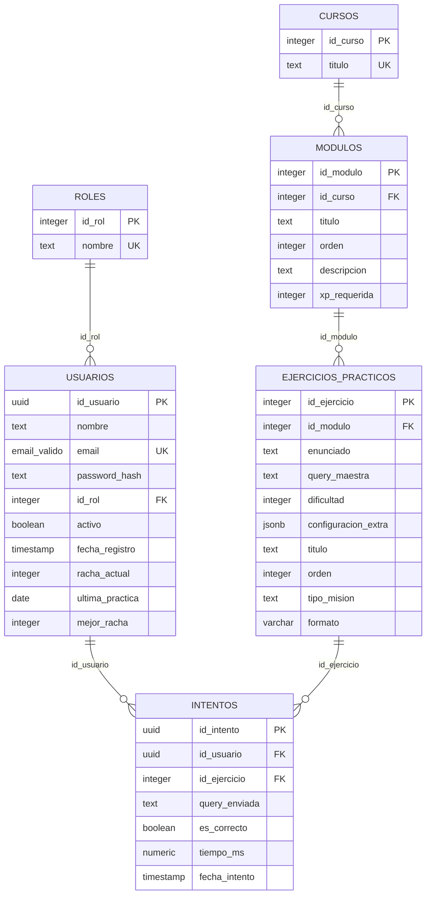
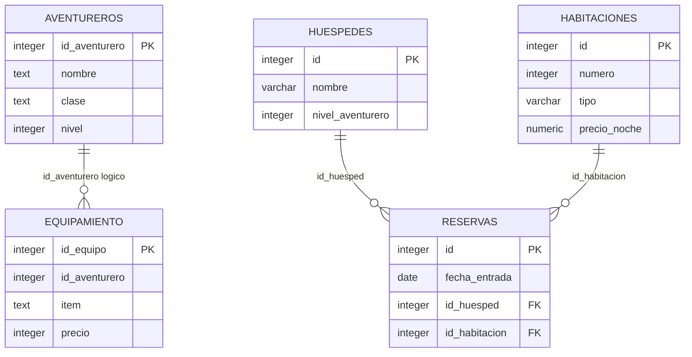
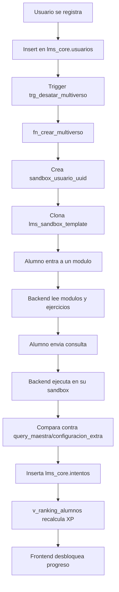

# Flujo de Base de Datos de Dagon

Documento de referencia creado a partir de `scripts/respaldo_dagon_multiverso.sql`.

Este archivo sirve para entender rapido como funciona la base de datos cada vez que se necesite modificar backend, validacion de ejercicios, progreso de usuarios, ranking, sandbox SQL o despliegue.

## Resumen del Respaldo

- Archivo fuente: `scripts/respaldo_dagon_multiverso.sql`
- Tamano revisado: 7044 lineas.
- Esquemas declarados: 24.
- Tablas declaradas: 130.
- Secuencias declaradas: 38.
- Cursos cargados: 2.
- Modulos cargados: 20.
- Ejercicios cargados: 94.
- Usuarios cargados: 22.
- Intentos cargados: 330.
- Extension usada: `pgcrypto`.
- Dominio propio: `lms_core.email_valido`.

> Importante: este respaldo contiene datos reales o de prueba de usuarios y valores en `password_hash`. No debe publicarse ni compartirse sin sanitizar.

## Esquemas

### `lms_core`

Es el esquema principal de la plataforma. Guarda usuarios, cursos, modulos, ejercicios, intentos, ranking y auditoria.

Objetos principales:

- `usuarios`: identidad del alumno/profesor y datos de racha.
- `roles`: catalogo de roles.
- `cursos`: agrupador superior de modulos.
- `modulos`: unidades de aprendizaje con orden y XP requerida.
- `ejercicios_practicos`: misiones, enunciados, solucion maestra y configuracion pedagogica.
- `intentos`: historial de respuestas enviadas por usuarios.
- `auditoria_logs`: auditoria de cambios sensibles en ejercicios.
- `v_contenido_modulos`: vista para listar modulos con sus ejercicios.
- `v_ranking_alumnos`: vista para calcular progreso, ejercicios resueltos y XP.

### `lms_sandbox_template`

Es el molde base que se clona para cada usuario. Contiene las tablas de practica que los alumnos consultan o modifican dentro de su propio sandbox.

Tablas base:

- `aventureros`
- `equipamiento`
- `habitaciones`
- `huespedes`
- `reservas`

Relaciones declaradas:

- `reservas.id_huesped` referencia a `huespedes.id`.
- `reservas.id_habitacion` referencia a `habitaciones.id`.

Relacion logica no declarada como FK en el template:

- `equipamiento.id_aventurero` se usa como relacion hacia `aventureros.id_aventurero`, pero el respaldo no declara una FK formal para esa relacion.

### `sandbox_usuario_<uuid>`

Cada usuario tiene un esquema propio con el patron:

```text
sandbox_usuario_<id_usuario>
```

Estos esquemas son copias del template y permiten que cada alumno practique sin afectar a los demas.

El respaldo actual incluye varios esquemas de usuario ya creados. Algunos contienen objetos extra creados durante ejercicios, por ejemplo:

- `mascotas`
- `pociones`
- `log_cambios`
- funciones y triggers creados por practicas avanzadas

Esto significa que el respaldo mezcla estructura limpia, datos semilla, datos de usuarios e historial de practica.

## Diagrama MER Principal



## Diagrama MER del Sandbox



## Flujo General de la Plataforma

### 1. Registro de Usuario

1. El backend inserta un registro en `lms_core.usuarios`.
2. `id_usuario` se genera con `gen_random_uuid()` de `pgcrypto`.
3. El trigger `trg_desatar_multiverso` se ejecuta despues del insert.
4. El trigger llama a `lms_core.fn_crear_multiverso()`.
5. La funcion crea el esquema `sandbox_usuario_<uuid>`.
6. La funcion clona todas las tablas de `lms_sandbox_template`.
7. La funcion copia los datos semilla del template hacia el sandbox nuevo.
8. El usuario queda con su propio entorno SQL.

### 2. Carga de Dashboard

1. El frontend solicita modulos y progreso.
2. El backend lee `lms_core.modulos`.
3. El backend cruza con `lms_core.v_ranking_alumnos` para calcular XP.
4. El desbloqueo se decide contra `modulos.xp_requerida`.
5. El frontend muestra cursos, modulos, ejercicios y progreso.

### 3. Carga de Ejercicios

1. El backend consulta `lms_core.ejercicios_practicos` por `id_modulo`.
2. Cada ejercicio trae:
   - enunciado
   - `query_maestra`
   - dificultad
   - tipo de mision
   - formato de UI
   - `configuracion_extra`
3. El frontend decide la experiencia segun `formato`:
   - `drag_drop`
   - `editor`
   - `sql`
   - `diagram`

### 4. Validacion de Ejercicios SQL

1. El alumno envia una consulta desde el frontend.
2. El backend identifica al usuario.
3. El backend debe usar el esquema `sandbox_usuario_<id_usuario>` como sandbox activo.
4. La consulta del alumno se ejecuta o se compara segun el tipo de ejercicio.
5. La respuesta se compara contra `query_maestra` o reglas en `configuracion_extra`.
6. Se guarda un registro en `lms_core.intentos`.
7. Si `es_correcto = true`, el ranking y XP se actualizan de forma derivada por la vista.

### 5. Ranking y XP

La vista `lms_core.v_ranking_alumnos` calcula:

- `ejercicios_resueltos`: conteo de ejercicios distintos correctos.
- `xp_total`:
  - ejercicios `RAPIDA`: 5 XP.
  - otros ejercicios: `dificultad * 10`.

La vista solo considera usuarios con `activo = true`.

### 6. Soft Delete de Usuarios

El respaldo define la regla `regla_soft_delete_usuarios`.

Cuando alguien ejecuta:

```sql
DELETE FROM lms_core.usuarios WHERE id_usuario = ...;
```

PostgreSQL lo reemplaza por:

```sql
UPDATE lms_core.usuarios SET activo = false WHERE id_usuario = OLD.id_usuario;
```

Esto conserva historial de intentos y ranking historico, pero oculta al usuario de vistas que filtran `activo = true`.

## Objetos de `lms_core`

### `usuarios`

Guarda datos de identidad, autenticacion y racha.

Columnas clave:

- `id_usuario`: UUID generado por `gen_random_uuid()`.
- `email`: usa dominio `lms_core.email_valido`.
- `password_hash`: texto de autenticacion.
- `activo`: usado por soft delete y ranking.
- `racha_actual`, `ultima_practica`, `mejor_racha`: gamificacion.

Relaciones:

- `id_rol` referencia a `roles.id_rol`.
- `intentos.id_usuario` referencia a `usuarios.id_usuario`.

### `roles`

Catalogo de roles por nombre unico.

Observacion: en el respaldo revisado muchos usuarios aparecen con `id_rol` nulo. Si el sistema necesita permisos reales por rol, conviene normalizar este dato.

### `cursos`

Agrupa modulos. El respaldo contiene:

- `Senda del Guerrero: Administracion SQL`
- `Senda del Arquitecto: Diseno de BD`

### `modulos`

Define el mapa curricular.

Campos importantes:

- `id_curso`
- `titulo`
- `orden`
- `descripcion`
- `xp_requerida`

Modulos actuales:

1. Teoria de Conjuntos
2. Manipulacion de Datos
3. El Arquitecto y los Vinculos
4. La Prueba de Dagon
5. Los Sellos Sagrados
6. Sellos de Validacion
7. El Generador de IDs
8. Los Filtros de Precision
9. Las Ventanas Magicas
10. Los Planos del Gremio
11. Patrones de Busqueda
12. Los Hechizos Automaticos
13. Rituales Programados
14. Los Gatillos Magicos
15. Viaje Temporal
16. Cerrojos de Filas
17. Algebra Relacional
18. Roles del Gremio
19. Seguridad a Nivel de Fila
20. Proyecto Final

### `ejercicios_practicos`

Tabla central del contenido educativo.

Campos importantes:

- `id_modulo`: modulo al que pertenece.
- `enunciado`: instrucciones para el alumno.
- `query_maestra`: solucion esperada o patron de validacion.
- `dificultad`: de 1 a 5.
- `configuracion_extra`: JSONB para reglas especiales.
- `titulo`: nombre visible del ejercicio.
- `orden`: orden dentro del modulo.
- `tipo_mision`: `HISTORIA` o `RAPIDA`.
- `formato`: tipo de interfaz.

Formatos detectados:

- `editor`: ejercicios SQL normales.
- `sql`: ejercicios DDL, transacciones o validaciones especiales.
- `drag_drop`: ejercicios introductorios con banco de palabras.
- `diagram`: ejercicios de modelado MER.

Usos de `configuracion_extra`:

- `wordBank` para drag and drop.
- `tipo_validacion` para DDL, texto o transacciones.
- reglas de diagramas como `min_entidades`, `min_relaciones` y entidades requeridas.
- metadatos pedagogicos para UI especial.

### `intentos`

Historial de respuestas del alumno.

Campos importantes:

- `id_usuario`
- `id_ejercicio`
- `query_enviada`
- `es_correcto`
- `tiempo_ms`
- `fecha_intento`

Esta tabla alimenta progreso, ranking, analitica y futuras recomendaciones personalizadas.

### `auditoria_logs`

Guarda auditoria cuando se modifica `query_maestra` en ejercicios.

Campos:

- `tabla_afectada`
- `operacion`
- `usuario_db`
- `fecha`
- `datos_antiguos`

## Vistas

### `v_contenido_modulos`

Lista modulos con ejercicios asociados.

Uso esperado:

- vista de contenido
- auditoria rapida del temario
- revision del orden de ejercicios

### `v_ranking_alumnos`

Calcula ranking y XP sin guardar XP en una tabla separada.

Ventajas:

- evita inconsistencias de XP duplicado.
- recalcula con base en intentos correctos.

Cuidado:

- si `intentos` crece mucho, conviene agregar indices o considerar una vista materializada.

## Funciones

### `lms_core.fn_crear_multiverso()`

Funcion de alta importancia.

Responsabilidad:

- crear un esquema sandbox por usuario.
- clonar tablas desde `lms_sandbox_template`.
- copiar datos semilla.
- asignar ownership a `app_sandbox_user`.
- crear y vincular una secuencia propia para `aventureros.id_aventurero`.

Observacion tecnica:

La funcion solo crea y retargetea explicitamente la secuencia de `aventureros`. Las otras tablas del template tambien tienen secuencias en el respaldo. Conviene revisar si las tablas clonadas conservan defaults apuntando al template o si necesitan secuencias propias por usuario.

### `lms_core.fn_auditar_ejercicios()`

Funcion de auditoria.

Se ejecuta cuando cambia `query_maestra` de un ejercicio.

Guarda la fila anterior en `auditoria_logs.datos_antiguos` como JSONB.

### Funciones dentro de sandboxes

El respaldo contiene funciones creadas en sandboxes por ejercicios avanzados, por ejemplo:

- `fn_auditar()`
- `fn_saludo()`

Estas no son funciones base de plataforma; representan estado generado por alumnos durante practicas de triggers/procedures.

## Triggers y Reglas

### `trg_desatar_multiverso`

Tabla: `lms_core.usuarios`

Evento:

```sql
AFTER INSERT
```

Accion:

```sql
EXECUTE FUNCTION lms_core.fn_crear_multiverso()
```

Resultado: crea automaticamente el sandbox del usuario.

### `trg_auditar_update_ejercicio`

Tabla: `lms_core.ejercicios_practicos`

Evento:

```sql
AFTER UPDATE
```

Condicion:

```sql
old.query_maestra IS DISTINCT FROM new.query_maestra
```

Resultado: audita cambios de solucion maestra.

### `regla_soft_delete_usuarios`

Tabla: `lms_core.usuarios`

Evento:

```sql
ON DELETE
```

Resultado: convierte el delete en `UPDATE activo = false`.

## Secuencias

Secuencias core:

- `lms_core.auditoria_logs_id_log_seq`
- `lms_core.cursos_id_curso_seq`
- `lms_core.ejercicios_practicos_id_ejercicio_seq`
- `lms_core.modulos_id_modulo_seq`
- `lms_core.roles_id_rol_seq`

Secuencias template:

- `lms_sandbox_template.aventureros_id_aventurero_seq`
- `lms_sandbox_template.equipamiento_id_equipo_seq`
- `lms_sandbox_template.habitaciones_id_seq`
- `lms_sandbox_template.huespedes_id_seq`
- `lms_sandbox_template.reservas_id_seq`

Secuencias por sandbox:

- varias secuencias `aventureros_id_aventurero_seq`.
- secuencias creadas por ejercicios, como `mascotas_id_seq` o `pociones_id_seq`.

Observacion critica:

El respaldo fija `lms_core.modulos_id_modulo_seq` en `4`, pero existen modulos con IDs hasta `20`. Si se inserta un nuevo modulo sin ID explicito, podria intentar usar un ID ya existente. La secuencia deberia quedar como minimo en `20`.

## Constraints y Relaciones

### Core

- `cursos.titulo` es unico.
- `roles.nombre` es unico.
- `usuarios.email` es unico.
- `modulos(id_curso, orden)` es unico.
- `modulos.orden` debe ser mayor que 0.
- `ejercicios_practicos.dificultad` debe estar entre 1 y 5.
- `ejercicios_practicos.id_modulo` referencia a `modulos.id_modulo` con `ON DELETE CASCADE`.
- `intentos.id_usuario` referencia a `usuarios.id_usuario` con `ON DELETE CASCADE`.
- `intentos.id_ejercicio` referencia a `ejercicios_practicos.id_ejercicio` con `ON DELETE CASCADE`.
- `modulos.id_curso` referencia a `cursos.id_curso` con `ON DELETE CASCADE`.
- `usuarios.id_rol` referencia a `roles.id_rol` con `ON DELETE RESTRICT`.

### Sandbox Template

- Cada tabla base tiene primary key.
- `reservas.id_habitacion` referencia a `habitaciones.id`.
- `reservas.id_huesped` referencia a `huespedes.id`.
- `equipamiento.id_aventurero` funciona como relacion logica, pero no tiene FK declarada en el respaldo.

## Permisos

### `app_backend_user`

Uso esperado: usuario del backend Spring Boot.

Permisos principales:

- `USAGE` sobre `lms_core`.
- CRUD sobre tablas core.
- `SELECT` sobre `v_ranking_alumnos`.
- uso de secuencias core.
- `USAGE` sobre `lms_sandbox_template`.

### `app_sandbox_user`

Uso esperado: ejecucion aislada de consultas de alumnos.

Permisos principales:

- `USAGE` sobre `lms_sandbox_template`.
- CRUD sobre tablas del template.
- uso de secuencias del template.
- permisos sobre varios sandboxes ya existentes.

Punto de revision:

El respaldo concede `GRANT ALL` sobre sandboxes especificos ya existentes, pero los nuevos sandboxes dependen de lo que haga `fn_crear_multiverso()` y de privilegios por defecto. Conviene verificar que un usuario nuevo pueda usar todas sus tablas y secuencias sin tocar otros esquemas.

## Flujo de Restauracion del Respaldo

El respaldo esta pensado como reconstruccion completa, no como migracion incremental.

Orden general:

1. Elimina objetos existentes con `DROP`.
2. Crea esquemas.
3. Crea extension `pgcrypto`.
4. Crea dominio `email_valido`.
5. Crea funciones.
6. Crea tablas.
7. Crea secuencias.
8. Vincula secuencias a columnas.
9. Carga datos.
10. Ajusta valores de secuencias con `setval`.
11. Agrega primary keys, unique constraints y checks.
12. Agrega regla de soft delete.
13. Agrega triggers.
14. Agrega foreign keys.
15. Concede permisos.

Advertencia:

Como el respaldo inicia con muchos `DROP`, ejecutarlo sobre una BD productiva destruye y reconstruye objetos. Debe usarse solo con backup previo y ventana controlada.

## Flujo Educativo de Datos



## Alertas y Mejoras Detectadas

- El respaldo contiene datos personales y passwords en texto dentro de `password_hash`; debe sanitizarse antes de compartir o subir.
- `lms_core.modulos_id_modulo_seq` queda por debajo del ID maximo de modulos.
- Los sandboxes guardados incluyen estado generado por usuarios; no son una plantilla limpia.
- `equipamiento.id_aventurero` no tiene FK formal hacia `aventureros`.
- La funcion `fn_crear_multiverso()` solo retargetea la secuencia de `aventureros`; revisar las otras secuencias del sandbox.
- El respaldo mezcla estructura, semillas, intentos reales y objetos creados por practicas.
- Si `intentos` crece, `v_ranking_alumnos` necesitara indices adecuados.

## Consultas Rapidas para Investigar la BD

Buscar tablas core:

```bash
rg -n "CREATE TABLE lms_core" scripts/respaldo_dagon_multiverso.sql
```

Buscar tablas del template:

```bash
rg -n "CREATE TABLE lms_sandbox_template" scripts/respaldo_dagon_multiverso.sql
```

Buscar funciones:

```bash
rg -n "CREATE FUNCTION" scripts/respaldo_dagon_multiverso.sql
```

Buscar triggers y reglas:

```bash
rg -n "CREATE TRIGGER|CREATE RULE" scripts/respaldo_dagon_multiverso.sql
```

Buscar modulos:

```bash
rg -n "INSERT INTO lms_core.modulos" scripts/respaldo_dagon_multiverso.sql
```

Buscar constraints y foreign keys:

```bash
rg -n "ADD CONSTRAINT|FOREIGN KEY" scripts/respaldo_dagon_multiverso.sql
```

## Recomendacion de Fuente de Verdad

Para desarrollo y despliegue conviene separar el respaldo actual en tres archivos:

1. `estructura.sql`: esquemas, dominios, funciones, tablas, vistas, constraints, triggers y grants.
2. `semillas.sql`: cursos, modulos, ejercicios base y datos iniciales de sandbox template.
3. `respaldo_datos.sql`: usuarios, intentos y sandboxes con datos reales o de prueba.

Mientras esa separacion no exista, `scripts/respaldo_dagon_multiverso.sql` debe tratarse como respaldo completo y sensible.
